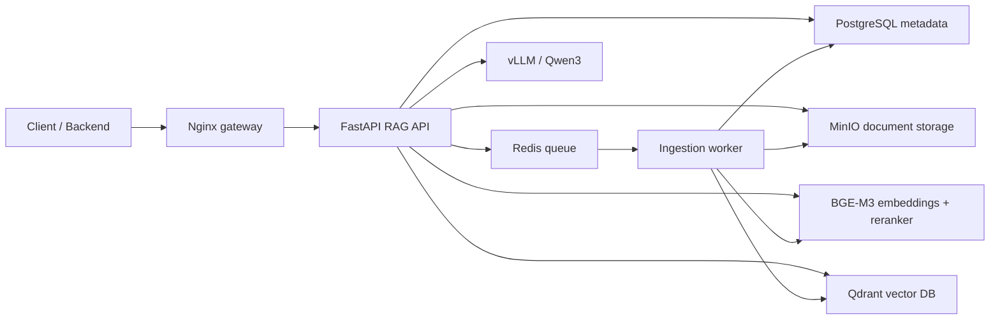

# Mohkam Self-Hosted RAG

Production-oriented RAG system for hundreds of Arabic and English documents, built as a separate Docker Compose project.

The default stack is tuned for one NVIDIA RTX 4090:

- vLLM OpenAI-compatible LLM server: `Qwen/Qwen3-14B-AWQ`
- Retrieval model server: `BAAI/bge-m3` embeddings and `BAAI/bge-reranker-v2-m3`
- Qdrant vector database
- PostgreSQL metadata and audit logs
- Redis/RQ ingestion jobs
- MinIO document object storage
- FastAPI API gateway with API-key auth
- Nginx edge gateway, Prometheus, Grafana

Qwen3 supports 119 languages and dialects, including Arabic variants. BGE-M3 supports 100+ languages, and the selected BGE reranker is multilingual. These defaults are intentional for Arabic legal/business corpora.

## Quick Start

From this directory:

```bash
docker compose up -d --build
```

The stack is runnable with safe local defaults, but production should use real secrets:

```bash
cp .env.example .env
./scripts/generate-secrets.sh
docker compose up -d --build
```

Open:

- API docs: http://localhost:5001/docs
- Grafana, optional: http://localhost:3001
- Prometheus: http://localhost:9090
- MinIO console: http://localhost:9001

The first run downloads the LLM, embedding model, and reranker into the `hf-cache` volume. That can take a while.

## Ubuntu GPU Host Requirements

- Ubuntu host recommended for NVIDIA GPU containers
- Recent NVIDIA driver for the RTX 4090
- Docker Engine with Docker Compose
- NVIDIA Container Toolkit configured for Docker
- At least 64 GB system RAM recommended
- Fast NVMe storage for model cache and document volumes

Check GPU visibility:

```bash
docker run --rm --gpus all nvidia/cuda:12.9.0-base-ubuntu22.04 nvidia-smi
```

If your server resets Docker Hub pulls, this stack avoids Docker Hub for the main runtime services where practical:

- MinIO from Quay
- Qdrant from GitHub Container Registry
- Prometheus from Quay
- vLLM and retrieval GPU bases from NVIDIA NGC
- Docker official images through Amazon ECR public mirror

Grafana remains optional because the exact Grafana image is most reliably published on Docker Hub. Start it only when Docker Hub access works:

```bash
docker compose --profile observability up -d grafana
```

## API Usage

Set the API key from `.env`:

```bash
export RAG_API_KEY=change-me-rag-api-key
```

Upload documents:

```bash
curl -X POST http://localhost:5001/v1/documents \
  -H "X-API-Key: $RAG_API_KEY" \
  -F "tenant_id=default" \
  -F 'metadata={"case_id":"case-001","language":"ar"}' \
  -F "files=@/path/to/contract.pdf"
```

Ask in Arabic:

```bash
curl -X POST http://localhost:5001/v1/query \
  -H "X-API-Key: $RAG_API_KEY" \
  -H "Content-Type: application/json" \
  -d '{
    "tenant_id": "default",
    "question": "ما هي أهم الالتزامات المذكورة في العقد؟",
    "top_k": 24,
    "rerank_top_n": 8
  }'
```

Responses include cited sources (`S1`, `S2`, etc.) with document IDs, chunk IDs, pages when available, scores, and excerpts.

## Architecture



## Supported Documents

- PDF
- DOCX
- TXT / Markdown
- HTML
- CSV
- XLSX
- PPTX

Scanned PDFs need OCR before upload. For production OCR, add a separate OCR microservice before ingestion.

## RTX 4090 Tuning

Defaults prioritize quality while fitting a single 24 GB GPU:

```env
LLM_MODEL=Qwen/Qwen3-14B-AWQ
LLM_MAX_MODEL_LEN=16384
LLM_GPU_MEMORY_UTILIZATION=0.74
RETRIEVAL_DEVICE=cuda
```

If vLLM fails with CUDA OOM, lower one or more:

```env
LLM_GPU_MEMORY_UTILIZATION=0.68
LLM_MAX_MODEL_LEN=8192
RETRIEVAL_DEVICE=cpu
```

If you prefer more headroom and faster cold starts, switch to:

```env
LLM_MODEL=Qwen/Qwen3-8B-AWQ
```

## Production Notes

- Rotate every value in `.env`.
- Put TLS in front of `GATEWAY_PORT` using your load balancer or reverse proxy.
- Keep PostgreSQL, Redis, MinIO, Qdrant, vLLM, and retrieval-models on the internal Docker network only.
- Use tenant IDs and metadata filters to isolate corpora.
- Use `docker compose up -d --scale worker=2` for faster ingestion. Keep one vLLM service per GPU.
- Back up PostgreSQL and MinIO volumes. Qdrant can be backed up separately or rebuilt from stored documents.
- Monitor `/readyz`, Prometheus, and GPU memory.

## Helpful Commands

Run a smoke test with an Arabic sample document:

```bash
./scripts/smoke-test.sh
```

View logs:

```bash
docker compose logs -f api worker retrieval-models llm
```

Stop:

```bash
docker compose down
```

Stop and remove data:

```bash
docker compose down -v
```
